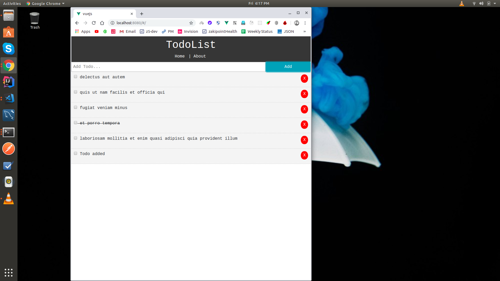

# TodoList
TodoList app is build using vuejs as frontend technology and jsonplaceholder for api, which is Fake Online REST API for Testing and Prototyping 

[jsonplaceholder]('https://jsonplaceholder.typicode.com/todos' 'jsonplaceholder')

## Some snapshots

